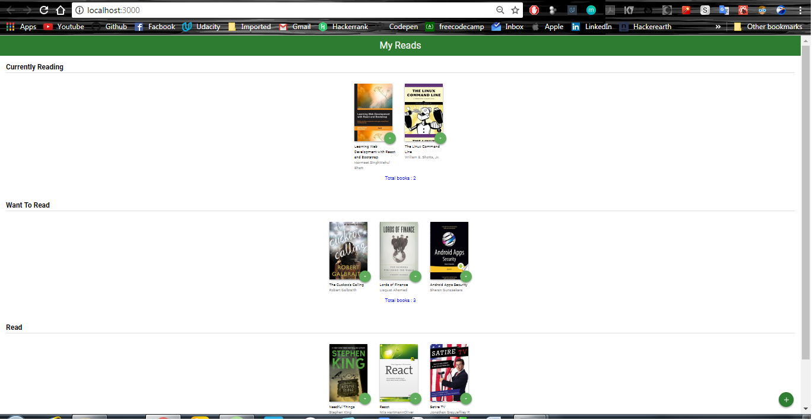
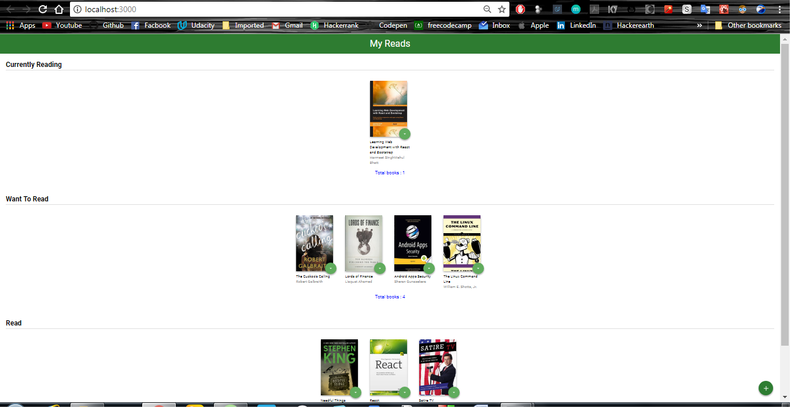
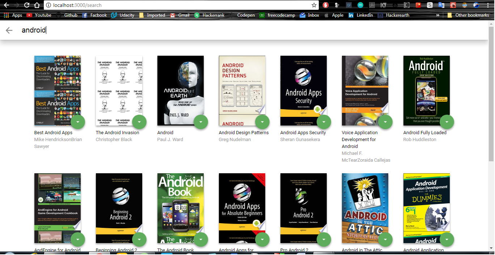
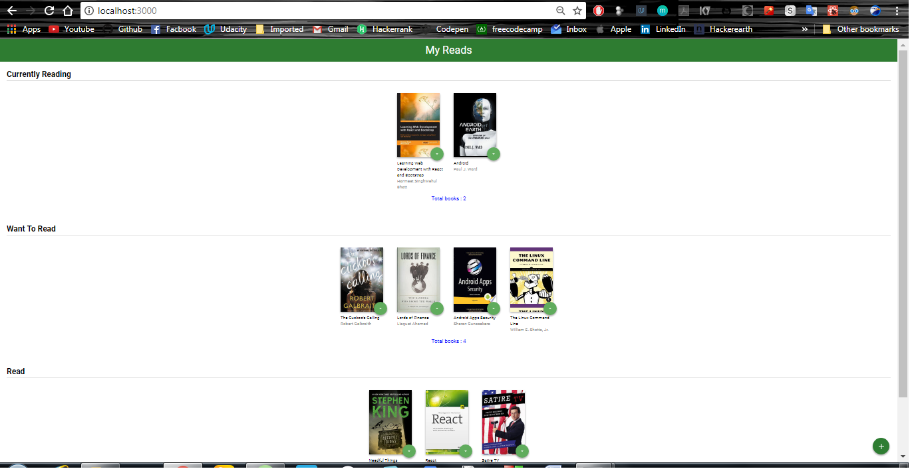

## Udacity React Nanodegree First project

## About My-Reads Project
   This is the first project of React Nanodegree program. In this project books are arranged in three shlefs . We can interchange the book one shelf to another. By clicking the arrow icon we can change the books from one shelf to another.
   By clicking the [`+`](http://localhost:3000/search) icon you can add books in your favourite shelfs.
   This is made by the starter template code provided by Udacity.

## How to start
   * Fistly download this project in your machine or you can clone this repository by running this command on your git shell
     `git clone https://github.com/Rahul2360/MyReads-Project.git `.
   * Run the command `npm install` and `npm start`
   * After this a web page is automatically load in the browser where you can access the project.

## Screenshot of project
   * Home page of the project

   

   * Change books in one shelf to another

   

   * Search section in the project

   

   * Added books in main page

   

## Description
    In this project there are three different shelfs on the main page. We can move the books from one shelf to anothe by clicking th arrow icon.
    If we click on the `+` icon then we can search more books.
    After searching the particular book we can add these books in our main page in our shelfs.
    By this project we can arrange our books so that we cannot forget the books name that we want to read.

## create-react-app

This project was bootstrapped with [Create React App](https://github.com/facebookincubator/create-react-app). You can find more information on how to perform common tasks [here](https://github.com/facebookincubator/create-react-app/blob/master/packages/react-scripts/template/README.md).
